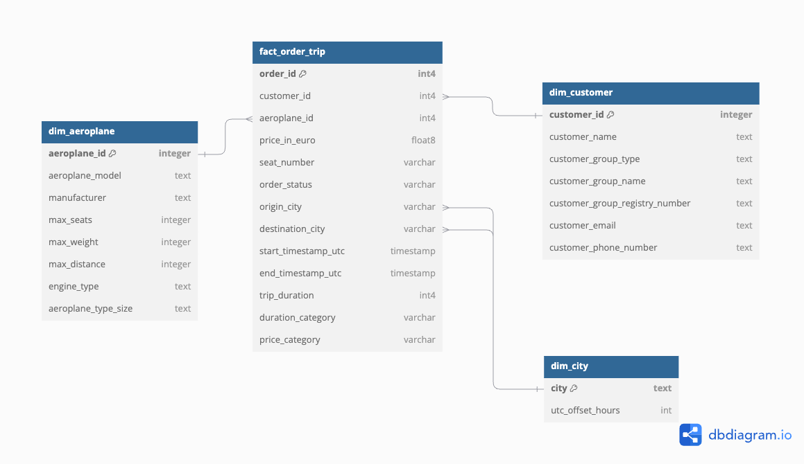
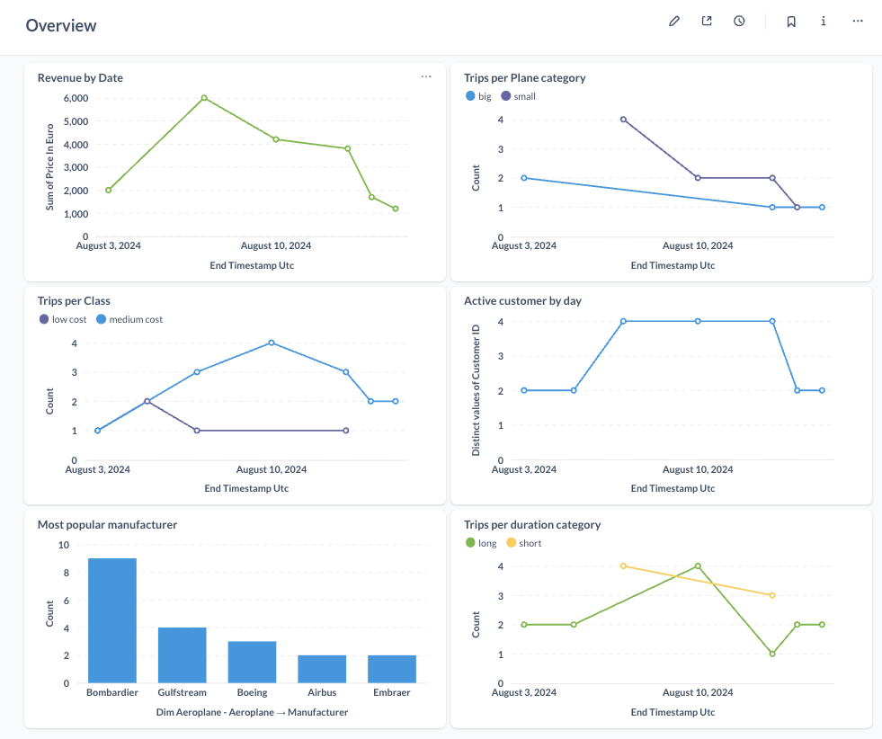

# Data Engineering Project

## Modeling

As part of developing the exercise, the first step was to get in touch with the data.  
Understand what kind of data is available and how they interact with each other.  

Based on what was provided, I can assume the data comes from an application system, where the modeling aims to support the backend and not necessarily business analysis. With this in mind, it was possible to reshape a little bit the modeling into something more queriable by people.  

Using a dimensional modeling approach, I have come to the following model:



From the raw data where we have a table for `order` and another for `trip`, for business purposes, this split is not useful. That's why they are now joined in one new table called `fact_order_trip`. The naming states clearly that it's not on the trip level, but rather in the order with the trip dimensions added.  

Denormalizing here the data can bring benefits because it reduces the need for one join. Aggregating by trip, on the other hand, can reduce the number of questions the fact can respond to. This modeling aims to keep flexibility and give to the business person the tools.  

For the dimension, the reasoning was straightforward: combine entities in one table. For both aeroplane and customer, I've added all dimensions to each respective entity. This leads to a low-complexity model and avoids the usage of different tables to get information on the same entity.  

The general thought was to denormalize what is possible to facilitate the query process. This step is usually tricky because denormalization leads to data duplication in the final table. Although it's always a matter of trade-off and getting the best solution for each scenario, in this case, the end user being capable of finding answers in the easiest way possible was prioritized.

---

## Setup

### Tools:
- **Metabase**  
- **DBT**  
- **Postgres**  
- **Docker**  

In the task provided, some tools are listed. In order to simplify the project but to not lose the goal of it, I've opted for open-source tools that can be easily used locally.  

Metabase was chosen due to its simplicity and similarity with Looker—not in UI or having a LookML, but in terms of facilitating data exploration and analysis, providing a no-code approach.  

Postgres in this project is both the data storage and processing engine. Using object storage tools such as MinIO with engines like Trino was also a possibility, but it would require more steps and time.  

### Local Setup:

To set up both tools, I've created a `docker-compose` file with configuration for all the resources.  
The DBT was not deployed as a standalone container because it was being used locally, and I was trying to emulate a development environment. When deploying it, there are plenty of alternatives to run DBT.  

To run everything locally:  
```bash
```
docker-compose up --build

## DBT

The DBT project was modeled using the DBT recommendation of having a division in 3 layers (similar to the medallion architecture):

- **Staging**
- **Intermediate**
- **Marts**

The staging layer is straightforward; it's where we must apply naming conventions, patterns, and also casting.  

The line in the intermediate layer is thin. My approach was to reduce the complexity of the models—there is no fixed rule as the previous layer. If DBT guidelines were followed, the marts were supposed to have aggregations. I didn't go for this because I wanted to give flexibility on the exposition side.  

For this, I've only copied the intermediate layer for most models, just adding category attribution on some fields.  

I'll not get into too much detail into the models built because they are self-explanatory. The only thing I believe is worth mentioning is the logic to set up the timestamp to the same timezone.  

Both start time and end time seem to be in the local timezone, origin, and destination city respectively. In the city dimension tables, I've added an offset-to-UTC column, which allows all the times to UTC. This was made manually since I don't have any API to provide this information, and because there is a limited amount of cities/timezones, this is not an issue as well.  

The materialization of the marts layer is `table`, and the remaining is `view`.  
Time consistency is key to data integrity, and in our case, is also important to calculate metrics such as total trip duration by plane, for instance.

---

## Exposing the Data

I've tried to follow a simple approach, building a unique overview dashboard with interesting metrics.



Some concerns I've had when building business metrics include defining them. A data engineer should not say what a business metric is but guide the business on the steps to. Metrics such as active customers should be defined by business and (hopefully) have its definition shared across the company.  

The same is valid on how to define revenue. Should the revenue include booked trips or only finished ones? This can be asked by when the customer pays, although including booked trips can lead to needing to compute also the canceled trips and getting the refund value.  

For the example above, we can see that the right questions should be made to business and contracts should be defined. For instance, if only finished trips should be included, we could just filter them in the mart layer, but it would diminish the breadth of the fact. Having a metric for cancellations wouldn’t be possible.

---

## Reflections

As a data engineer, I need to understand that my role is to enhance business decision-making and make the creation of new products based on data possible. With this in mind, I need to deliver business value at first and then think about tooling.  

Tools are always changing, but the fundamentals last longer. In the data engineering lifecycle, we must get data from data sources and make them available somehow to business. Being brief, we must provide data and access to it. For this reason, a storage, processing, and visualization layer is mandatory. We must work around it.  

Also, for this reason, I've chosen to combine the storage and processing in this exercise. It's not a scalable solution in the long term but it will be hundreds of times better than Excel.  

Fortunately, today it is possible to deploy a minimum usable data stack with few steps as shown in this project.  

I've worked in different companies with different budgets. In my first job as a data engineer, I had to run some scripts locally because there were no cloud resources available. Adaptation is key. My objective was to create a data platform MVP, but the business goals need to be achieved. If sending an email for stakeholders manually with a print of my dashboard is the only viable option, there is nothing much beyond it.

---

## Scaling the Project

When scaling the project, development workflow should be enhanced and focused. But different from software engineering, testing is really tricky in data.  

For a DBT project, we need to aim for readability and consistency. For this reason, the usage of packages like `sqlfluff` is needed. Maintaining standards will help our future selves when upgrading models.  

Not only checking the code but also adding DBT compilation tests as part of the CI/CD is mandatory. Deploying a code that does not even compile into production is not acceptable.  

Continuing the CI/CD, we can create sample data to test the models and then define expected output. This will guarantee the minimum quality of a deploy.  

After the CI/CD, we can add monitoring layers to our data. DBT tests can work to avoid bad data coming into final reports. Monitoring data after execution is also possible. There are custom approaches to do it, and there are also plenty of tools available for it, such as Elementary or Monte Carlo.  

My point is: sometimes data is not that friendly. It's easy to know that a trip without an ID is not right. But if for some error when fetching the data, all trips’ prices are set to 50, it's not that clear.
